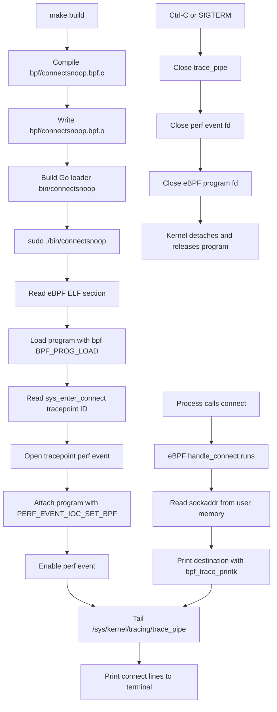

# Connectsnoop Lifecycle

## Notes

- The object file has no maps or relocations, so the Go loader reads raw
  instructions directly from the ELF section.
- The tracepoint attachment is owned by the open perf-event fd. When the process
  exits and closes that fd, the kernel detaches the program.
- `trace_pipe` is a live stream. Reading it consumes matching trace output.
